<h1 align="center"> <p> WHU-Railway3D </p></h1>
<h3 align="center">
<a href="" target="_blank">WHU-Railway3D: A Diverse Dataset and Benchmark for Railway Point Cloud Semantic Segmentation</a>
</h3>

Point cloud semantic segmentation (PCSS) shows great potential in generating accurate 3D semantic maps for digital twin railways. Deep learning-based methods have seen substantial advancements, driven by numerous PCSS datasets. Nevertheless, existing datasets tend to neglect railway scenes, with limitations in scale, categories, and scene diversity. This motivated us to establish WHU-Railway3D, a diverse PCSS dataset specifically designed for railway scenes. 

WHU-Railway3D is categorized into urban, rural, and plateau railways based on scene complexity and semantic class distribution. The dataset spans 30 km with 4 billion points labeled into 11 classes (e.g., rails, overhead lines). In addition to 3D coordinates, WHU-Railway3D provides rich attribute information such as reflected intensity and number of returns. Cutting-edge methods are extensively evaluated on the dataset, followed by in-depth analysis. Lastly, key challenges and potential future work are identified to stimulate further innovative research.

## 📌 Download

Please fill out this [**Data Request**](https://forms.gle/HswKqzUWRuG4UQMZ6) if you have access to google forms. 

If not, please fill out this [**one**](https://wj.qq.com/s2/13387420/ac80) (alternative link for Chinese users). 

Download links will be sent automatically after completing the application.

Main web page of our group : http://3s.whu.edu.cn/ybs/index.htm

## 📌 Dataset

### 1.1 Overview

Our dataset is categorized based on scene complexity and category distribution patterns into urban railways, rural railways, and plateau railways. Each category covers a distance of approximately 10 kilometers, resulting in a dataset consisting of about 4 billion data points. Each point is labeled under one of the 11 categories, such as rails, masts, overhead lines, and fences.


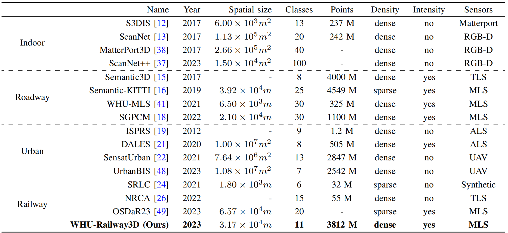

### 1.2 Data Collection

- The urban railway dataset was captured using [Optech's Lynx Mobile Mapper System](https://www.geo3d.hr/3d-laser-scanners/teledyne-optech/optech-lynx-sg-mobile-mapper) in a city section located in central China, covering a road length of approximately 10.7 km. In contrast to the street roadway benchmark, the urban railway dataset was collected in complex railway environments, which contain more noise and challenging railway-related classes. 
- The rural railway dataset was collected using an MLS system equipped with two [HiScan-Z LiDAR sensors](https://www.zhdgps.com/detail/car_portable-HiScan-Z) in a field area, covering a road length of approximately 10.6 km. This dataset presents various challenges, including occlusion caused by vegetation and terrain variations.
- The plateau railway dataset was obtained using a [Rail Mobile Measurement System](http://www.hirail.cn/product_detail/id/7.html) (rMMS) equipped with a 32-line LiDAR sensor in a plateau zone, spanning a road length of approximately 10.4 km. The plateau railway dataset poses a challenge due to the imbalance in the distribution of point numbers among different categories, requiring strategies to address the issue of balanced learning for diverse modalities.

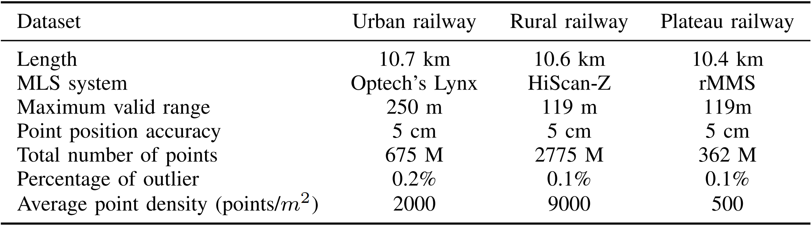

### 1.3 Semantic Annotations

- Rails: tracks of the train, as shown in Fig. 3 (g).
- Bed: the section between tracks, including sleepers, ballast, etc. Refer to Fig. 3 (h).
- Overhead lines: including power lines and catenary lines, as shown in Fig. 3 (a).
- Fences: including fences and sound insulation panels.
- Vegetation: including trees and grass, as shown in Fig. 3 (f)
- Poles: including utility poles and other pole-like objects, an example can be found in Fig. 3 (i).
- Towers: including masts and electricity transmission towers near the railways, refer to Fig. 3(b).
- Ground: including cement and rough ground.
- Buildings: including houses, high-rise buildings, warehouses, etc. Refer to Fig. 3 (d).
- Support devices: devices for supporting power lines, as shown in Fig. 3 (c).
- Others: Other unclassified objects, such as pedestrians, vehicles, etc.

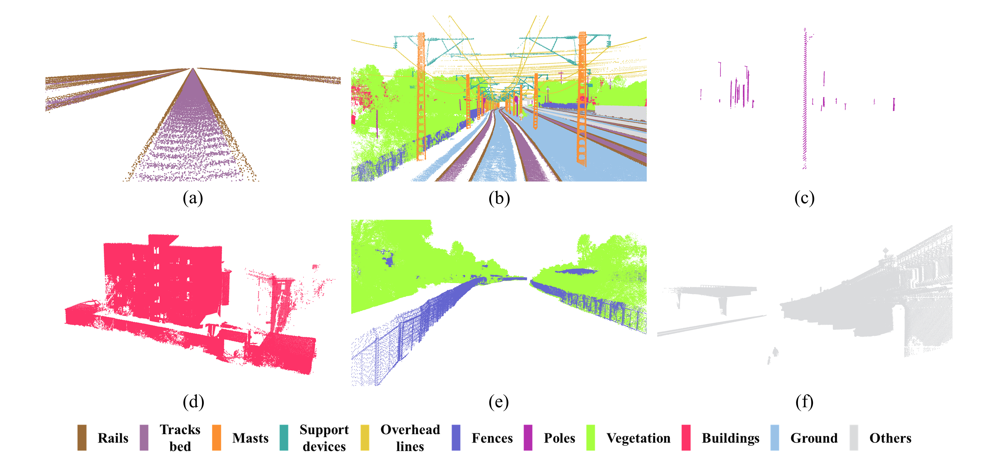


### 1.4 Statistics

To ensure compatibility with modern GPUs for deep learning-based semantic segmentation tasks, the annotated dataset needed to be partitioned into smaller chunks. The point cloud partitioning process took into careful consideration the variations in point density and scene complexity across different railway scenes, leading to the adoption of specific strategies. In the case of the urban railway scene, 40 tiles were randomly allocated, with 24 tiles assigned for training, 8 tiles for validation, and 8 tiles for testing. Similarly, for the rural railway scene, 60 tiles were divided, consisting of 36 tiles for training, 12 tiles for validation, and 12 tiles for testing. As for the plateau railway scene, a total of 40 tiles were created, with 24 tiles for training, 8 tiles for validation, and 8 tiles for testing. Overall, for each railway scene dataset, the training data accounts for approximately 60%, the validation data accounts for about 20%, and the testing data accounts for about 20%.

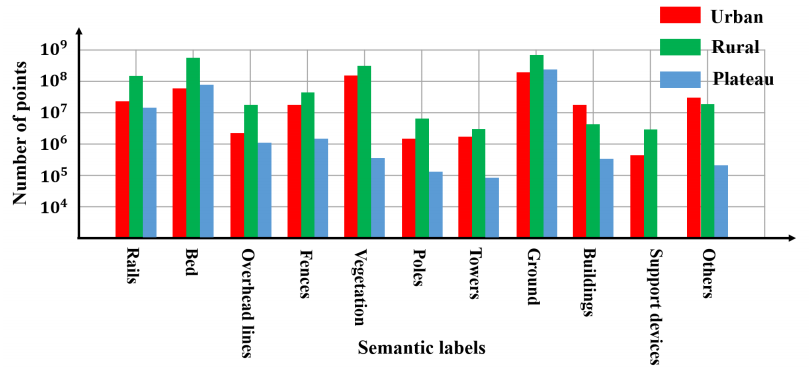

## ✨ Benchmark

We carry out an extensive evaluation of numerous cutting-edge methods using our dataset and provide an in-depth analysis of the benchmark results. Lastly, we identify key challenges and potential future work to stimulate further innovative research within this community.

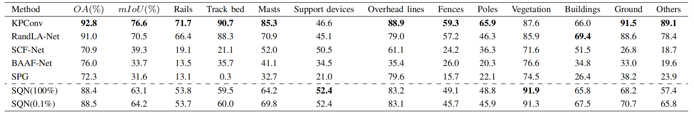

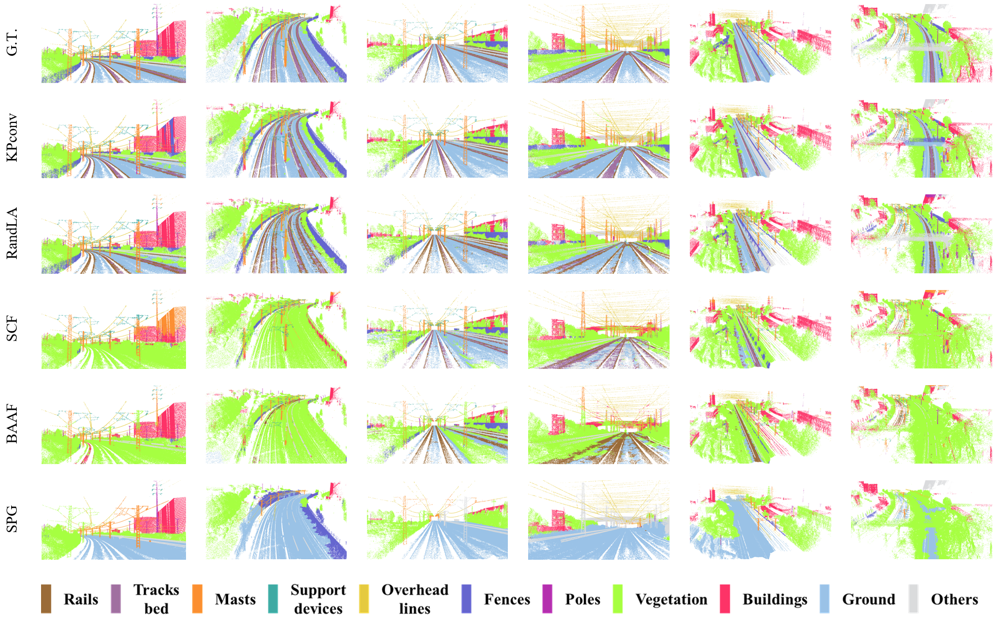

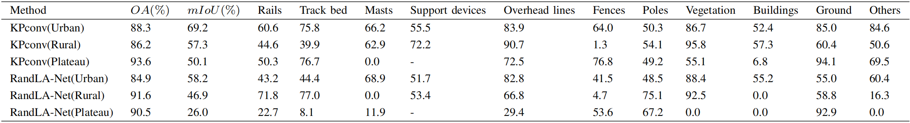

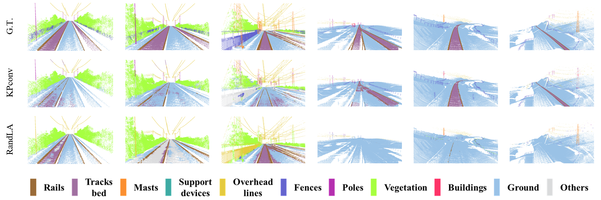

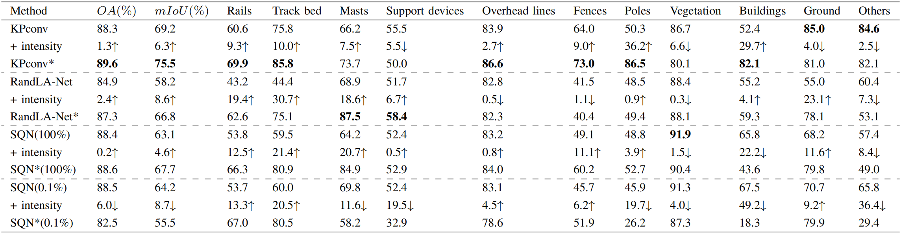

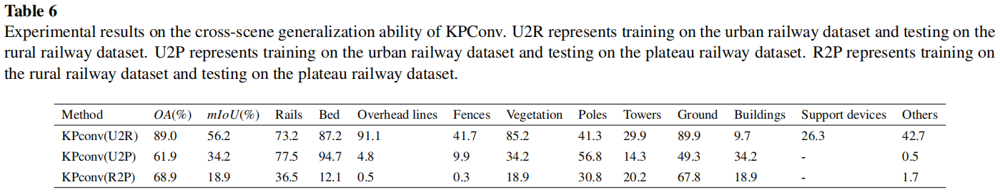

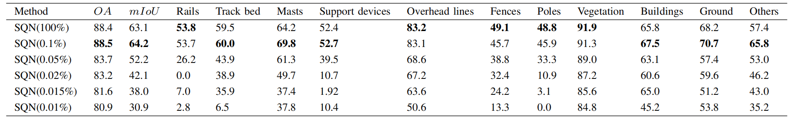

## ⭐ Citation

If you find our work useful in your research, please consider citing:

```
@article{

}
```


## 🤝 Related Work

1. [SPG: Large-scale Point Cloud Semantic Segmentation with Superpoint Graphs](https://github.com/loicland/superpoint_graph)
2. [KPconv: Flexible and Deformable Convolution for Point Clouds](https://github.com/HuguesTHOMAS/KPConv)
3. [RandLA-Net: Efficient Semantic Segmentation of Large-Scale Point Clouds](https://github.com/QingyongHu/RandLA-Net)
4. [SCF-Net: Learning Spatial Contextual Features for Large-Scale Point Cloud Segmentation](https://github.com/leofansq/SCF-Net)
5. [BAAF-Net: Semantic Segmentation for Real Point Cloud Scenes via Bilateral Augmentation and Adaptive Fusion](https://github.com/ShiQiu0419/BAAF-Net)
6. [SQN: Weakly-Supervised Semantic Segmentation of Large-Scale 3D Point Clouds](https://github.com/QingyongHu/SQN)