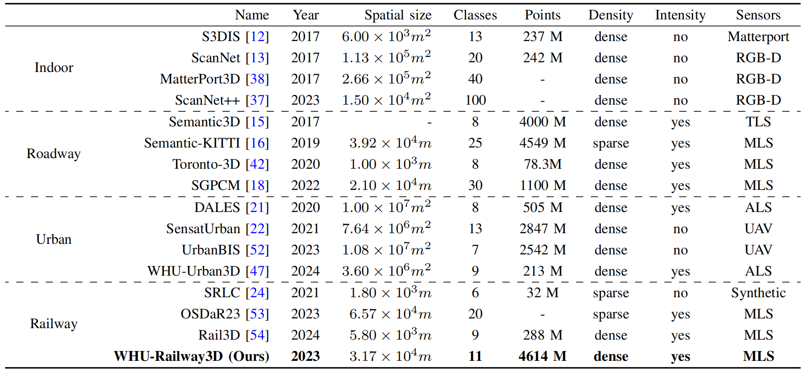
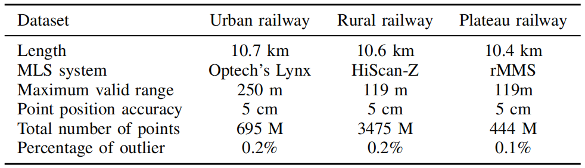
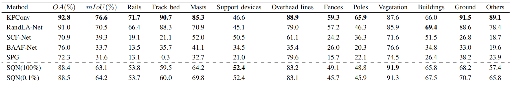
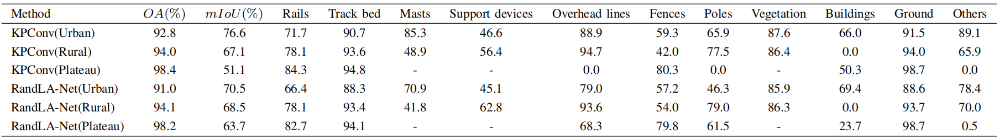
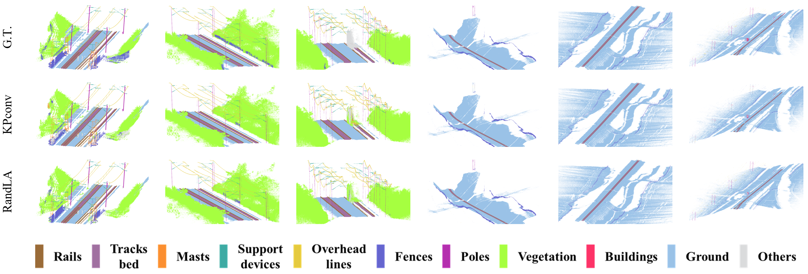
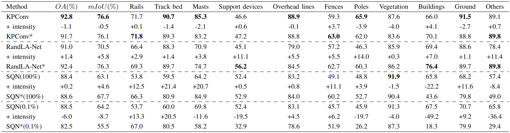
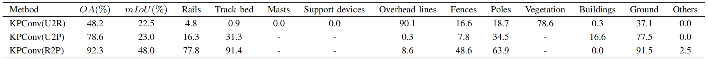

<h1 align="center"> <p> WHU-Railway3D </p></h1>
<h3 align="center">
<a href="https://github.com/WHU-USI3DV/WHU-Railway3D/" target="_blank">WHU-Railway3D: A Diverse Dataset and Benchmark for Railway Point Cloud Semantic Segmentation</a>
</h3>

This paper introduces WHU-Railway3D, a diverse point cloud semantic segmentation (PCSS) dataset specifically tailored for railway scenes. Spanning approximately 30 km and comprising 4.6 billion points, the dataset includes 11 richly annotated categories across urban, rural, and plateau railway environments. In addition to 3D coordinates, it provides rich attribute information such as reflected intensity, scanning angle, and number of returns. Cutting-edge methods are extensively evaluated on the dataset, followed by an in-depth analysis. Lastly, key challenges and potential future work are identified to stimulate further innovation. Overall, WHU-Railway3D serves as a valuable resource for advancing research in digital twin railways and the digitization of railway infrastructure. 

## 📌 Download

Please fill out this [**Data Request**](https://forms.gle/HswKqzUWRuG4UQMZ6) if you have access to google forms. 

If not, please fill out this [**one**](https://wj.qq.com/s2/13387420/ac80) (alternative link for Chinese users). 

Download links will be sent automatically after completing the application.

Main web page of our group : http://3s.whu.edu.cn/ybs/index.htm

## 📌 Dataset

### 1.1 Overview

Our dataset is categorized based on scene complexity and category distribution patterns into urban railways, rural railways, and plateau railways. Each category covers a distance of approximately 10 kilometers, resulting in a dataset consisting of about 4.6 billion data points. Each point is labeled under one of the 11 categories, such as rails, track bed, masts, overhead lines, and fences.




### 1.2 Data Collection

- The urban railway dataset was captured using [Optech's Lynx Mobile Mapper System](https://www.geo3d.hr/3d-laser-scanners/teledyne-optech/optech-lynx-sg-mobile-mapper) in a city section located in central China, covering a road length of approximately 10.7 km. In contrast to the street roadway benchmark, the urban railway dataset was collected in complex railway environments, which contain more noise and challenging railway-related classes. 
- The rural railway dataset was collected using an MLS system equipped with two [HiScan-Z LiDAR sensors](https://www.zhdgps.com/detail/car_portable-HiScan-Z) in a field area, covering a road length of approximately 10.6 km. This dataset presents various challenges, including occlusion caused by vegetation and terrain variations.
- The plateau railway dataset was obtained using a [Rail Mobile Measurement System](http://www.hirail.cn/product_detail/id/7.html) (rMMS) equipped with a 32-line LiDAR sensor in a plateau zone, spanning a road length of approximately 10.4 km. The plateau railway dataset poses a challenge due to the imbalance in the distribution of point numbers among different categories, requiring strategies to address the issue of balanced learning for diverse modalities.



### 1.3 Semantic Annotations

- Rails: hot-rolled steel with a cross-section approximate to an I-beam, providing a reliable rolling surface for train wheels to travel on, as shown in Fig. 3 (a).

- Track bed: the section between rails, including sleepers, ballast, etc. Refer to Fig. 3 (a).

- Masts: load-bearing steel structures for the overhead line system and supporting devices, as shown in Fig. 3 (b).

- Support devices: including support arms, strings of suspended insulators, and other supporting equipment used to secure overhead lines in the specified position and height, as shown in Fig. 3 (b).

- Overhead lines: a specialized form of transmission line erected above the railway line to supply power to electric locomotives, as shown in Fig. 3 (b).

- Fences: serve as demarcation or protective barriers for railway tracks, aiming to prevent trespassing and vandalism, as shown in Fig. 3 (e).

- Poles: utility poles and other pole-like objects, as shown in Fig. 3 (c).

- Vegetation: including trees and plants, refer to Fig. 3 (e).

- Buildings: structures or constructions surrounding the railway, including low-rise houses, tall buildings, warehouses, etc. Refer to Fig. 3 (d).

- Ground: concrete pavement or bare ground.

- Others: other objects such as overpasses, chimneys, transmission towers, tower cranes, vehicles, and pedestrians, as shown in Fig. 3 (f).


### 1.4 Statistics

To ensure compatibility with modern GPUs for deep learning-based semantic segmentation tasks, the annotated dataset needed to be partitioned into smaller chunks. The point cloud partitioning process took into careful consideration the variations in point density and scene complexity across different railway scenes, leading to the adoption of specific strategies. In the case of the urban railway scene, 40 tiles were randomly allocated, with 24 tiles assigned for training, 8 tiles for validation, and 8 tiles for testing. Similarly, for the rural railway scene, 60 tiles were divided, consisting of 36 tiles for training, 12 tiles for validation, and 12 tiles for testing. As for the plateau railway scene, a total of 20 tiles were created, with 12 tiles for training, 4 tiles for validation, and 4 tiles for testing. Overall, for each railway scene dataset, the training data accounts for approximately 60%, the validation data accounts for about 20%, and the testing data accounts for about 20%.


## ✨ Benchmark

We conduct a extensive evaluation of various state-of-the-art methods using our dataset. Experiment code, models, and results will be made publicly accessible to ensure comprehensive details for accurate replication and validation of our findings.

- **Table 1**: Quantitative experimental results of different methods on urban railway dataset.




- **Table 2**: Quantitative experimental results of KPconv and RandLA-Net on the rural railway dataset and plateau railway dataset.





- **Table 3**: Experimental results of semantic segmentation before and after the introduction of intensity information in different methods. The asterisks (*) in the upper right corner indicate the results obtained by incorporating intensity information.



- **Table 4**: Experimental results on the cross-scene generalization ability of KPConv. U2R represents training on the urban railway dataset and testing on the rural railway dataset. U2P represents training on the urban railway dataset and testing on the plateau railway dataset. R2P represents training on the rural railway dataset and testing on the plateau railway dataset.



- **Table 5**: Quantitative results of SQN using different rates of labeled data.


## ⭐ Citation

If you find our work useful in your research, please consider citing:

```
@article{whu2024railway3d,
  title={WHU-Railway3D: A Diverse Dataset and Benchmark for Railway Point Cloud Semantic Segmentation},
  author={Bo Qiu, Yuzhou Zhou, Lei Dai, Bing Wang, Jianping Li, Zhen Dong, Chenglu Wen, Zhiliang Ma, Bisheng Yang},
  journal={IEEE Transactions on Intelligent Transportation Systems},
  year={2024},
  publisher={IEEE},
  note={doi:{\color{blue}\href{https://doi.org/10.1109/TITS.2024.3469546}{10.1109/TITS.2024.3469546}}}
}
```


## 🤝 Related Work

1. [SPG: Large-scale Point Cloud Semantic Segmentation with Superpoint Graphs](https://github.com/loicland/superpoint_graph)
2. [KPconv: Flexible and Deformable Convolution for Point Clouds](https://github.com/HuguesTHOMAS/KPConv)
3. [RandLA-Net: Efficient Semantic Segmentation of Large-Scale Point Clouds](https://github.com/QingyongHu/RandLA-Net)
4. [SCF-Net: Learning Spatial Contextual Features for Large-Scale Point Cloud Segmentation](https://github.com/leofansq/SCF-Net)
5. [BAAF-Net: Semantic Segmentation for Real Point Cloud Scenes via Bilateral Augmentation and Adaptive Fusion](https://github.com/ShiQiu0419/BAAF-Net)
6. [SQN: Weakly-Supervised Semantic Segmentation of Large-Scale 3D Point Clouds](https://github.com/QingyongHu/SQN)