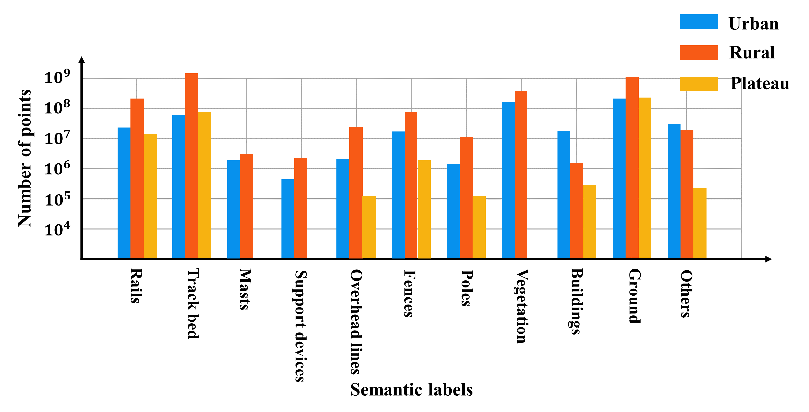
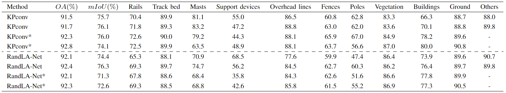

### Regarding the categorization of the "others" class.

The unclassified class usually consists of a very small portion of the dataset. However, for our dataset, the "others" class has some particularities. I will explain this in detail. 

Our primary goal was to develop a dataset specifically tailored for point cloud semantic segmentation of railway scenes, with a particular focus on railway infrastructure. However, given the complexity and variability of railway scenes, we acknowledge that our dataset also includes a diverse range of objects that are not the primary focus. Specifically, in urban railway scenes, these objects mainly includes overpasses, chimneys, transmission towers, tower cranes, vehicles, and pedestrians. In rural railway scenes, these objects mainly comprises overpasses, transmission towers, vehicles, and pedestrians. In plateau railway scenes, these objects primarily consists of transmission towers. Therefore, we decided to group these less important objects into the "others". 

Among them, overpasses, chimneys, transmission towers, and tower cranes have relatively large volumes, resulting in a higher number of points. These objects are more frequently encountered in urban railway scenes, leading to a larger number of points in the "others" class. Statistically, the percentage of points classified as "others" in the three types of railway scenes datasets is 7.3%, 1.1%, and 0.1%, respectively.

Fig. 4 The distribution of point numbers among different semantic categories in the WHU-Railway3D dataset.

Furthermore, grouping these less important objects into the "others" category also arises from a practical perspective, aiming to simplify model training without compromising the ability to recognize and handle common but non-critical objects in real railway environments. 

### Inclusion of the "others" class in model training and evaluation. 

We chose to include the "others" category in training and evaluation for several reasons. 

**Firstly**, previous articles on deep learning-based PCSS methods of railway scenes typically incorporated the "others" category in both training and testing phases, and also included in the evaluation metrics. For instance, the article from IEEE Transactions on Intelligent Transportation Systems journal titled "Self-Attentive Local Aggregation Learning With Prototype Guided Regularization for Point Cloud Semantic Segmentation of High-Speed Railways" (DOI: 10.1109/TITS.2023.3281352) and the article from the Automation in Construction journal titled "Point cloud semantic segmentation of complex railway environments using deep learning" (DOI: 10.1016/j.autcon.2022.104425). 

**Secondly**, our experiments results suggest that the inclusion or exclusion of the "others" category during both training and testing phases does not significantly affect the overall segmentation performance of the network. However, the absence of the "others" category may have a certain negative impact on the segmentation of minority classes, such as masts and support devices. 

Using KPConv and RandLA-Net as baselines, we conducted experiments on the urban railway dataset to investigate the impact of the "others" category on network segmentation performance. We conducted two sets of repeated experiments on both KPConv and RandLA-Net to mitigate the impact of random errors. As discussed in Section V.A, intensity information enhances overall segmentation performance in fully supervised networks. Hence, both networks were trained using coordinate and intensity infomation. KPConv was trained for 200 epochs until convergence, while RandLA-Net was trained for 100 epochs. Network hyperparameters were consistent with those outlined in Section IV-D. Quantitative results are presented in the table below. The asterisk (*) in the upper right corner indicates that "others" category are not involved in the training and testing phase.

Table 1: Quantitative experimental results obtained when the “others” category is not involved in training and testing phase

According to Table 1, for KPConv, the absence of the "others" category leads to a slight improvement in the IoU of categories with a large number of points, such as rails, track bed, vegetation, and ground. For buildings, the increase in IoU is a little larger, closer to 10%. In contrast, the IoU of masts and support devices decreases.  Overall, KPConv shows an improvement of approximately 1% in OA, but the change in mIoU is not significant. For RandLA-Net, the absence of the "others" category results in a significant decrease for support devices, a slight decrease in IoU for masts, and a slight increase for buildings, while the IoU changes for the remaining categories are not significant. Overall, RandLA-Net shows a slight decrease in mIoU, but there is almost no change in OA.

 

**Thirdly**, the decision to include the "others" category in both training and testing phases was driven by practical considerations. Real-world railway environments encompass diverse objects like overpasses and transmission towers, which are immutable facts. Ignoring these objects in the dataset could potentially lead to a model that is ill-equipped to handle real-world scenes. Moreover, manually removing points belonging to the "others" category from the raw point cloud data before using the segmentation model is impractical. 

So, what would be the actual segmentation performance of models trained without including the "others" category in practical applications? To investigate this, we conducted another experiment, wherein we only ignored the "others" category during training but did not remove points labeled as "others" from the test set. The experimental results are presented in Table 2. The asterisk (*) in the upper right corner denotes that the results were obtained when excluding the "others" category solely during the training phase. 

Table 2: Quantitative experimental results obtained when excluding the "others" category only during the training phase.

According to Table 2, it can be observed that when only ignored the "others" category on training phase, there is a significant decrease in the overall segmentation accuracy of the two networks. Furthermore, apart from categories with a large number of points such as rails, track bed, vegetation, and ground, there is a noticeable decrease in IoU for categories with relatively fewer number of points. Combining the results from Table 1 and Table 2, it is evident that the network tends to incorrectly classify points with the ground truth label of "others" as masts, support devices, overhead lines, fences, and buildings. This leads to a notable decline in segmentation performance in practical applications, which is clearly undesirable. Therefore, including the "others" category in the network training is necessary to help the network distinguish these less important objects. On the other hand, this inclusion helps in training a robust model capable of generalizing better across various unseen railway environments. 

